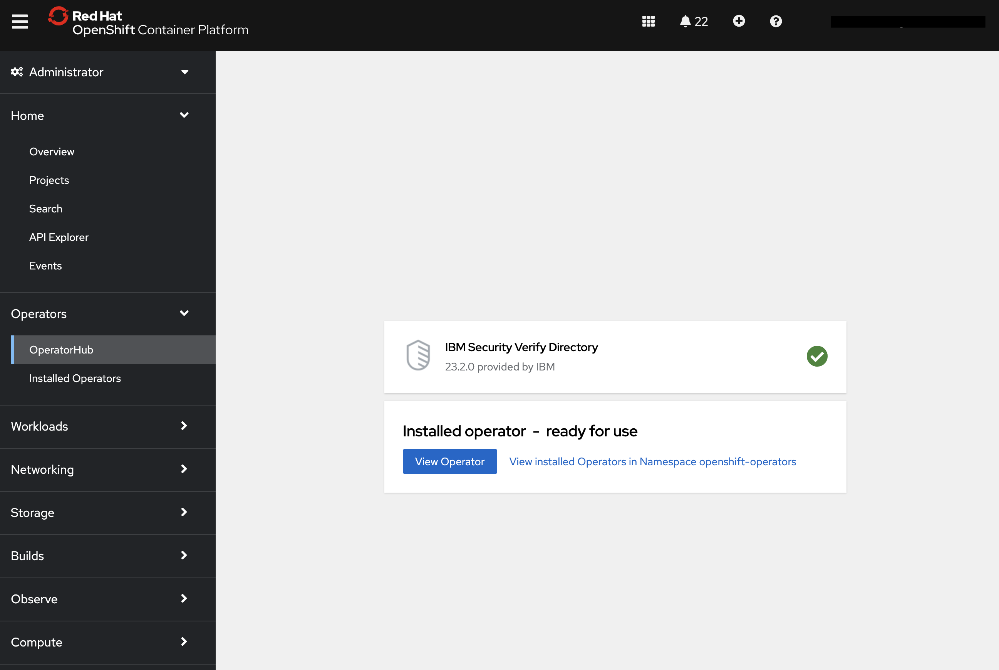

# IBM Security Verify Directory Operator
  * [Overview](#overview)
  * [Installation](#installation)
    + [RedHat OpenShift Environment](#redhat-openshift-environment)
    + [Standard Kubernetes Environment](#standard-kubernetes-environment)
      - [OperatorHub.io and the Operator Lifecycle Manager](#operatorhubio-and-the-operator-lifecycle-manager)
        * [Installing](#installing)
  * [Usage](#usage)
    + [Configuration](#Configuration)
    + [Persistent Volumes](#persistent-volumes)
    + [Deploying a Directory Server](#deploying-a-directory-server)
    + [Custom Resource Definition](#custom-resource-definition)
    + [Creating a Service](#creating-a-service)
 * [Troubleshooting](#Troubleshooting)

## Overview

IBM Security Verify Directory is a scalable, standards-based identity directory that helps simplify identity and directory management. Verify Directory helps consolidate identity silos into a single identity source. Verify Directory is purpose-built to provide a directory foundation that can help provide a trusted identity data infrastructure that assists in enabling mission-critical security and authentication. It is designed to deliver a reliable, scalable, standards-based identity data platform that interoperates with a broad range of operating systems and applications. Verify Directory supports Lightweight Directory Access Protocol (LDAP) V3, offering a flexible and highly scalable LDAP infrastructure.

For a detailed description of IBM Security Verify Directory refer to the [offical documentation](https://www.ibm.com/docs/en/svd).

The IBM Security Verify Directory operator provides lifecycle management of a scalable directory server environment.

The operator will manage the deployment of the replicated directory server containers, the initialisation of the replicated data, and will also manage the directory proxy which acts as a front-end to the environment.  The environment is depicted in the following figure.


At a high level, the operator will complete the steps depicted in the following figure when adding a new replica into the environment:


**Note:**

* The ‘principal’ term is used to describe the initial replica in the environment.
* There is no down-time in the environment after the initial replica has been configured.
* Each server is a complete replica.


## Installation

### RedHat OpenShift Environment

The [RedHat Operator Catalog](https://catalog.redhat.com/software/operators/search) provides a single place where Kubernetes administrators or developers can go to find existing operators that may provide the functionality that they require in an OpenShift environment. 

The information provided by the [RedHat Operator Catalog](https://catalog.redhat.com/software/operators/search) allows the Operator Lifecycle Manager (OLM) to manage the operator throughout its complete lifecycle. This includes the initial installation and subscription to the RedHat Operator Catalog such that updates to the operator can be performed automatically.

#### Procedure

To install the IBM Security Verify Directory operator from the RedHat Operator Catalog:

1. Log into the OpenShift console as an administrator.
2. In the left navigation column, click Operators and then OperatorHub. Type 'verify-directory-operator' in the search box, and click on the IBM Security Verify Directory Operator box that appears.

3. After reviewing the product information, click the `Install` button.

4. On the 'Install Operator' page that opens, specify the cluster namespace in which to install the operator. Also click the `Automatic` radio button under Approval Strategy, to enable automatic updates of the running Operator instance without manual approval from the administrator. Click the `Install` button.

5. Ensure that the IBM Security Verify Directory operator has been installed correctly by the Operator Lifecycle Manager. 


At this point the Operator Lifecycle Manager has been installed into the Kubernetes cluster, the IBM Security Verify Directory operator has been deployed and a subscription has been created that will monitor for any updates to the operator in the RedHat Operator Catalog. The IBM Security Verify Directory operator is now operational and any subsequent resources which are created of the kind `IBMSecurityVerifyDirectory` will result in the operator being invoked to manage the deployment.


### Standard Kubernetes Environment

In a standard (i.e. non-OpenShift) Kubernetes environment the operator can be installed and managed manually, or it can be installed and managed using the [Operator Lifecycle Manager](https://github.com/operator-framework/operator-lifecycle-manager) and [OperatorHub.io](https://operatorhub.io/). 

#### OperatorHub.io and the Operator Lifecycle Manager

Kubernetes operators are very useful tools that provide lifecycle management capabilities for many varying custom objects in Kubernetes. [OperatorHub.io](https://operatorhub.io/) provides a single place where Kubernetes administrators or developers can go to find existing operators that may provide the functionality that they require. 

The information provided by [OperatorHub.io](https://operatorhub.io/) allows the Operator Lifecycle Manager (OLM) to manage the operator throughout its complete lifecycle. This includes the initial installation and subscription to OperatorHub.io such that updates to the operator can be performed automatically.

##### Installing

To install the IBM Security Verify Access operator from OperatorHub.io:

1. Access the [IBM Security Verify Directory operator page on OperatorHub.io](https://operatorhub.io/operator/ibm-security-verify-directory-operator) in a browser.

2. Click the Install button on the page and follow the installation instructions.

3. Ensure that the IBM Security Verify Directory operator has been created by the Operator Lifecycle Manager. The phase should be set to "Succeeded". Note that this may take a few minutes.

```shell
kubectl get csv -n operators

NAME                                DISPLAY                                  VERSION   REPLACES  PHASE
verify-directory-operator.v23.3.0   IBM Security Verify Directory Operator   23.3.0              Succeeded
``` 

At this point the Operator Lifecycle Manager has been installed into the Kubernetes cluster, the IBM Security Verify Directory operator has been deployed and a subscription has been created that will monitor for any updates to the operator on OperatorHub.io. The IBM Security Verify Directory operator is now operational and any subsequent custom resources of the kind "IBMSecurityVerifyDirectory" will result in the operator being invoked to create the deployment.


## Usage

### Configuration

Each directory server deployment requires two configuration files, one to contain the configuration of the directory server, and another to contain the base configuration of the proxy.  These configuration files must be contained within a Kubernetes ConfigMap.

**NB**: The operator will read the LDAP port information from the server and proxy configuration, and will also read the admin credential information from the proxy configuration.  These configuration entries must be embedded as literals within the configuration, or referenced directly from a secret.  The other configuration formats (e.g. base64, ConfigMap, environment variable, external file) must not be used for these configuration entries.  For further details on the format of configuration data refer to the official product [documentation](https://www.ibm.com/docs/en/svd?topic=configuration-format).

#### Server Configuration

Documentation for the server configuration can be located in the YAML specification, which is available in the official documentation: [https://www.ibm.com/docs/en/svd?topic=specification-verify-directory-server]().

The server configuration must be stored in a Kubernetes ConfigMap.  The following example (isvd-server-config.yaml) shows the configuration of a directory server:

```
apiVersion: v1 
kind: ConfigMap 
metadata: 
  name: isvd-server-config 
data: 
  config.yaml: | 
    general: 
      license:
        accept: limited
        key: --license-key--

      key-stash: "B64:GAAAAHM1Q2lqMCtLYVppZUhOemprZi9XSGc9PThOcHIiXmA9RlB0Rji/nsd3MpTYvRzUn5joE804v57HdzKU2L0c1J+Y6BPNnceUEUr3I0I4v57HdzKU2L0c1J+Y6BPNnceUEUr3I0I/+VsYL0fIEQ=="

      admin: 
        dn: cn=root
        pwd: passw0rd1

    server:
      replication:
        admin:
          dn: cn=replcred
          pwd: passw0rd2

      suffixes:
        - dn: o=sample
          object-classes:
          - organization
```

The following command can be used to create the ConfigMap from this file:

```shell
kubectl apply -f isvd-server-config.yaml
```

#### Proxy Configuration

Documentation for the proxy configuration can be located in the YAML specification, which is available in the official documentation: [https://www.ibm.com/docs/en/svd?topic=specification-verify-directory-proxy]().

The proxy configuration must be stored in a Kubernetes ConfigMap, and should contain the general proxy configuration, excluding the proxy.server-groups and proxy.suffixes entries.  These entries will be automatically added by the operator based on the current replica configuration.  The following example (isvd-proxy-config.yaml) shows the configuration of the proxy:

```
apiVersion: v1 
kind: ConfigMap 
metadata: 
  name: isvd-proxy-config
  namespace: default 
data: 
  config.yaml: | 
    general: 
      id: isvd-proxy

      license:
        accept: limited
        key: --license-key--

      key-stash: "B64:GAAAAHM1Q2lqMCtLYVppZUhOemprZi9XSGc9PThOcHIiXmA9RlB0Rji/nsd3MpTYvRzUn5joE804v57HdzKU2L0c1J+Y6BPNnceUEUr3I0I4v57HdzKU2L0c1J+Y6BPNnceUEUr3I0I/+VsYL0fIEQ=="

      admin: 
        dn: cn=root
        pwd: passw0rd1
```

**NB**: The `key-stash` entry should be given the same value in both the server and proxy configurations.

The following command can be used to create the ConfigMap from this file:

```shell
kubectl apply -f isvd-proxy-config.yaml
```

### Persistent Volumes

A PersistentVolume (PV) is a piece of storage in the cluster that has been provisioned by an administrator or dynamically provisioned using Storage Classes. It is a resource in the cluster just like a node is a cluster resource. PVs are volume plugins like Volumes, but have a lifecycle independent of any individual Pod that uses the PV. This API object captures the details of the implementation of the storage, be that NFS, iSCSI, or a cloud-provider-specific storage system.

A PersistentVolumeClaim (PVC) is a request for storage by a user. It is similar to a Pod. Pods consume node resources and PVCs consume PV resources. Pods can request specific levels of resources (CPU and Memory). Claims can request specific size and access modes (e.g., they can be mounted ReadWriteOnce, ReadOnlyMany or ReadWriteMany, see AccessModes).

The directory data which is managed by a replica must be stored in a PVC, and each replica requires its own unique PVC.  So, a separate PVC must be created for each replica prior to the creation of the replica by the operator.

The PVC definition will be different based on the storage class which is being used, and each Kubernetes environment will provide their own storage classes.  Refer to your Kubernetes environment documentation for instructions on creating a PVC.

The following example (pvc.yaml) depicts a PVC which is created to use NFS storage:

```
apiVersion: v1
kind: PersistentVolume
metadata:
  name: isvd-server-1-pv
  labels:
    app: isvd-server-1-pv
spec:
  capacity:
    storage: 200Mi
  accessModes:
    - ReadWriteOnce
  persistentVolumeReclaimPolicy: Recycle
  nfs:
    server: "172.21.233.1"
    path: "/exports/isvd-server-1" 

---
apiVersion: v1
kind: PersistentVolumeClaim
metadata:
  name: isvd-server-1-pvc
spec:
  accessModes:
    - ReadWriteOnce
  storageClassName: ""
  resources:
    requests:
      storage: 10Gi
  selector:
    matchLabels:
      app: isvd-server-1-pv
```

The following command can be used to create the PVC from this file:

```shell
kubectl apply -f pvc.yaml
```
 

### Deploying a Directory Server

In order to deploy a directory server using the operator a new `IBMSecurityVerifyDirectory` custom resource must be created in the environment. 

The following example (isvd.yaml) shows the custom resource for a new replicated server, which contains two replicas:

```yaml
apiVersion: ibm.com/v1
kind: IBMSecurityVerifyDirectory

metadata:
  # The name which will be give to the deployment.
  name: isvd-server

spec:
  # Details associated with each directory server replica.  The list of
  # PVCs refers to th pre-created Persistent Volume Claims which will be 
  # used to store the directory data for each replica.  Each replica must 
  # have its own PVC.
  replicas:
    pvcs:
    - replica-1-pvc
    - replica-2-pvc
    
  # Details associated with the pods which will be created by the
  # operator.
  pods:
  
    # The name of the ServiceAccount to use to run the managed pod.
    # serviceAccountName: "default"

    # Details associated with the directory images which will be used.
    # This includes the repository which is used to store the server, seed
    # and proxy images, along with the label of the images.
    image: 
      repo:    icr.io/isvd
      label:   10.0.0.0
      
    # The ConfigMaps which store the server and proxy configuration.
    configMap:
      proxy:   
        name: isvd-proxy-config
        key:  config.yaml
      server:  
        name: isvd-server-config
        key:  config.yaml
```

The following command can be used to create the deployment from this file:

```shell
kubectl apply -f isvd.yaml
```

#### Custom Resource Definition

The `IBMSecurityVerifyDirectory` custom resource definition contains the following elements:

|Entry|Description|Default|Required?
|-----|-----------|-------|---------
|spec.replicas.pvcs[]|The names of the persistent volume claims which will be used by each replica.  Each replica must have its own PVC, and the PVC must be pre-created.| |Yes
|spec.pods.image.repo|The repository which is used to store the Verify Directory images.|icr.io/isvd|No
|spec.pods.image.label|The label of the Verify Directory images to be used. |latest|No
|spec.pods.image.imagePullPolicy|The pull policy for the images.|'Always' if the latest label is specified, otherwise 'IfNotPresent'.|No
|spec.pods.image.imagePullSecrets[]|A list of secrets which contain the credentials, used to access the images.| |No
|spec.pods.proxy.pvc|The name of the pre-created PVC which will be used by the proxy to persist runtime data.  This is only really required if schema updates are being applied using LDAP modification operations.| |No
|spec.pods.configMap.proxy.name spec.pods.configMap.proxy.key|The name and key of the ConfigMap which contains the initial configuration data for the proxy.  This should include everything but the proxy.server-groups and proxy.suffixes entries.| |Yes
|spec.pods.configMap.server.name spec.pods.configMap.server.key|The name and key of the ConfigMap which contains the configuration data for the server which is being managed/replicated.| |Yes
|spec.pods.resources|The compute resources required by each pod.  Further information can be found at [https://kubernetes.io/docs/concepts/configuration/manage-resources-containers/]().| |No
|spec.pods.envFrom[]|A list of sources to populate environment variables in the container.  Further information can be found at [https://kubernetes.io/docs/tasks/configure-pod-container/configure-pod-configmap/]().| |No
|spec.pods.env[]|A list of environment variables to be added to the pods.  Further information can be found at [https://kubernetes.io/docs/tasks/inject-data-application/define-environment-variable-container/]().| |No
|spec.pods.serviceAccountName|The Kubernetes account which the pods will run as.|default|No


### Creating a Service

When creating a service for the environment the selector for the service must match the selector for the proxy deployment, achieved by specifying the `app.kubernetes.io/kind` and `app.kubernetes.io/cr-name` labels.  

An example NodePort service definition is provided below:

```
apiVersion: v1
kind: Service
metadata:
  name: isvd-server
spec:
  ports:
    - port: 9443
      name: isvd-server
      protocol: TCP
      nodePort: 30443
  selector:
    app.kubernetes.io/kind: IBMSecurityVerifyDirectory
    app.kubernetes.io/cr-name: isvd-server
  type: NodePort
```

The server replicas will communicate with each other, and the proxy, using `ClusterIP` services.  These services will be automatically created by the operator.  Please note that if the LDAP port is enabled this will be used for communication.  If LDAPS is being used the server and proxy configurations must be configured so that they are able to trust the server certificates in use. 

## Troubleshooting

In the event that the system fails to deploy an environment, for example due to a misconfiguration of the LDAP server, the environment will be left in the failing state.  This will allow an administrator to examine the log files to help determine and rectify the cause of the failure.  If a deployment is in a failing state it won't be possible to modify, in the environment, the failing 'IBMSecurityVerifyDirectory' document.  The document must first be deleted from the environment.

To help debug any failures the log of the operator controller can also be examined.    The operator controller will be named something like, `verify-directory-operator-controller-manager-5856c8664c-wnnpm`, and will be in the namespace into which the operator was installed.

